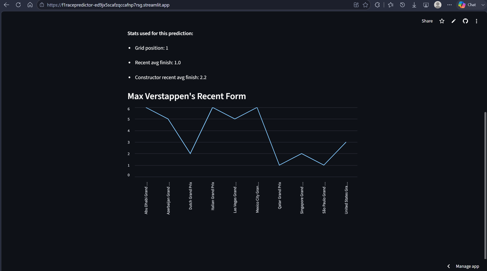
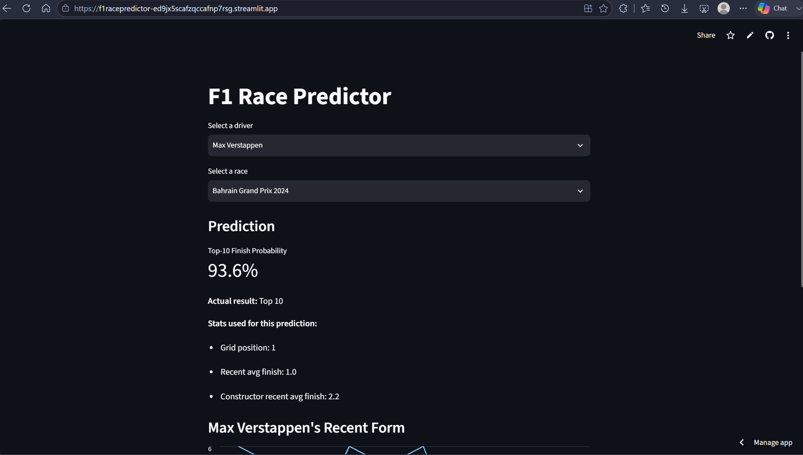

# F1 Race Predictor

Predicts whether a Formula 1 driver will finish in the points (top 10) for a given race, based on grid position, recent form, and constructor performance — with a live interactive dashboard to explore predictions against real historical outcomes.

**Live app:** https://f1racepredictor-ed9jx5scafzqccafnp7rsg.streamlit.app




## Overview

This project uses the [Formula 1 World Championship (1950–2024)](https://www.kaggle.com/datasets/rohanrao/formula-1-world-championship-1950-2020) dataset to train a binary classifier that predicts top-10 finishes. It started as a classification exercise (Andrew Ng's ML course, Course 1) and grew into a full pipeline: data cleaning, feature engineering, model comparison, and deployment.

## Features used

- **Grid position** — starting position for the race
- **Driver recent form** — rolling average finish over the driver's last 5 races
- **Constructor recent form** — rolling average finish for the team over its last 5 races
- **Grid vs. form gap** — difference between recent form and starting position

All rolling features are computed with a strict shift-before-rolling approach to avoid data leakage (a race never has access to its own result when computing "recent form").

## Modeling process

1. **Baseline**: logistic regression using grid position alone → 69.3% test accuracy
2. **Full model**: logistic regression with all 4 engineered features → **76.7% accuracy, 0.84 ROC-AUC**
3. **Random Forest**: tested as an alternative — overfit badly (96% train vs. 68.6% test accuracy) and was dropped in favor of the simpler, better-generalizing logistic regression model
4. **Qualifying pace feature**: tested adding gap-to-pole-time from qualifying lap data — accuracy barely moved (76.95%) and ROC-AUC slightly dropped, likely because it's highly correlated with grid position. Rejected in favor of the simpler 4-feature model.

**Final model**: Logistic Regression, 4 features, 76.7% test accuracy, 0.84 ROC-AUC, balanced precision/recall (~0.76–0.77) across both classes.

### What the model learned

Feature coefficients show constructor performance mattered more than grid position or the driver's own recent form — consistent with the well-known F1 saying, *"races are won at the track, championships are won at the factory."*

### Known limitation

The model can't account for race-day incidents — crashes, mechanical failures, grid penalties applied after qualifying. In several cases (e.g. Verstappen's retirement at the 2020 Austrian GP, Hamilton's penalty-affected 2022 Belgian GP), the model gave a high top-10 probability based on strong form and pace, but the driver didn't finish in the points due to factors the features can't capture. This is an inherent ceiling on accuracy for this kind of problem, not a modeling error.

## Debugging notes

- **Data leakage check**: all rolling averages use `.shift(1)` before `.rolling()` so a race's own result never leaks into its own features.
- **Groupby ordering bug**: an early version of the constructor rolling average was computed on a dataframe sorted by `driverId`, not `constructorId` — this meant `groupby('constructorId')` was technically correct but the ordering within each group was wrong, causing the feature to silently mirror each driver's individual average rather than blending both teammates' results. Caught by spot-checking a real constructor–season combination and noticing a teammate was missing from the comparison. Fixed by sorting a separate copy of the dataframe by `constructorId` before the rolling calculation.

## Tech stack

- **Data**: pandas
- **Modeling**: scikit-learn (Logistic Regression, Random Forest)
- **Dashboard**: Streamlit
- **Deployment**: Streamlit Community Cloud

## Project structure

```
f1_race_predictor/
├── data/
│   ├── df_model.csv       # processed, feature-engineered dataset
│   └── f1_model.pkl       # trained logistic regression model
├── notebooks/
│   └── 01_explore_data.ipynb   # full data exploration, feature engineering, model training
├── app.py                 # Streamlit dashboard
├── requirements.txt
└── README.md
```

## Running locally

```bash
git clone https://github.com/VarunP4835/f1_race_predictor.git
cd f1_race_predictor
pip install -r requirements.txt
streamlit run app.py
```

## Possible next steps

- Retrain with more recent races as they happen (currently trained through 2019, tested on 2020+)
- Add driver experience (races completed) as a feature to better flag rookie predictions
- Try a properly regularized/tuned Random Forest or gradient boosting model
- Add circuit type (street vs. permanent) as a feature
